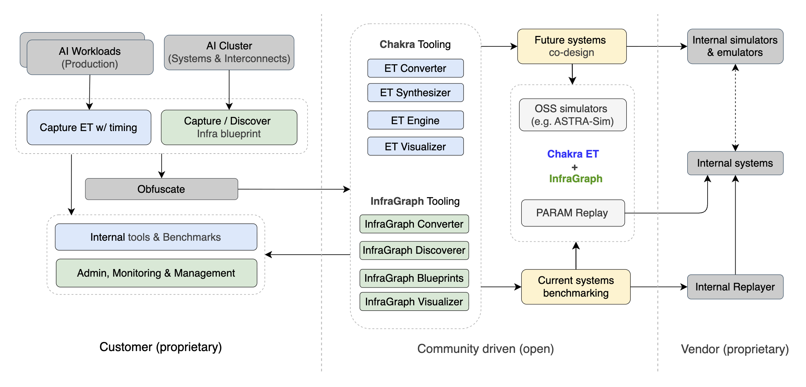

[](https://pypi.org/project/infragraph/)
[](https://pypi.org/project/infragraph/)
[](https://opensource.org/licenses/MIT)
[](https://infragraph.dev)
[](https://github.com/Keysight/infragraph/issues)
[](https://github.com/Keysight/infragraph/stargazers)
[](https://pypi.org/project/infragraph/)
[](https://github.com/Keysight/infragraph/actions/workflows/workflow.yml)
[](https://github.com/Keysight/infragraph/commits)
[](https://github.com/Keysight/infragraph/graphs/contributors)
[](https://github.com/Keysight/infragraph)
[](https://github.com/Keysight/infragraph/releases)

# InfraGraph (INFRAstructure GRAPH)

InfraGraph defines a [model-driven, vendor-neutral API](https://infragraph.dev/openapi.html) for capturing a system of systems suitable for use in co-designing AI/HPC solutions.

The model and API allows for defining physical infrastructure using a standardized graph like terminology.

In addition to the base graph definition, user provided `annotations` can `extend the graph` allowing for an unlimited number of different physical and/or logical characteristics/view.

Additional information such as background, schema and examples can be found in the [online documentation](https://infragraph.dev).

# Using InfraGraph CLI

InfraGraph ships with a CLI that lets you convert existing system descriptions into InfraGraph format and visualize infrastructure topologies.

Install by cloning the repo and running `make clean && make install`, or download the `.whl` from [releases](https://github.com/Keysight/infragraph/releases) and install it with `pip install infragraph-<version>.whl`.

**Convert system formats to InfraGraph** — translate output from tools like `lstopo` directly into an InfraGraph YAML/JSON definition:

```bash
# Convert lstopo XML output to an InfraGraph YAML file
infragraph translate lstopo -i lstopo_output.xml -o my_device.yaml --dump yaml
```

**Visualize infrastructure topologies** — generate an interactive, drillable HTML visualization from any InfraGraph definition:

```bash
# Generate a visualization with host and switch hints
infragraph visualize -i my_infrastructure.yaml -o ./viz --hosts "dgx_a100" --switches "leaf_switch,spine_switch"
# Then open ./viz/index.html in a browser
```

The visualizer produces a multi-level view: a top-level graph of instances and inter-device connectivity, with drill-down into each device's internal components (xPUs, NICs, CPUs, memory, PCIe topology, etc.).

> **Note:** More converters and tools are _work-in-progress_. See the [Ecosystem documentation](docs/src/ecosystem.md) for the full roadmap and we invite contributions from the community.

# Chakra + InfraGraph Ecosystem



MLCommons [Chakra](https://mlcommons.org/working-groups/research/chakra/) captures AI workload details as Execution Traces — graphs of operators, tensors, dependencies, and timing. InfraGraph complements Chakra by representing the underlying infrastructure — hosts, NICs, xPUs/accelerators, interconnects, and topologies. Together, Chakra + InfraGraph let you pair workload traces with infrastructure blueprints to analyze current systems and co-design future ones, while safely sharing artifacts across teams and partners.

For more details, see the [Ecosystem documentation](docs/src/ecosystem.md).

# Versioning Rules

Infragraph follows a structured versioning scheme to maintain consistency across releases and ensure clear dependency management. Each version reflects compatibility, schema evolution, and API stability expectations.

For versioning rules, refer [this readme.](docs/src/version.md)

# Contributing

Contributions can be made in the following ways:
- [open an issue](https://github.com/keysight/infragraph/issues) in the repository
- [fork the models repository](https://github.com/keysight/infragraph) and submit a PR
