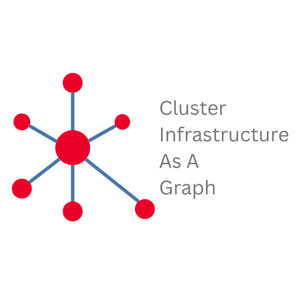

# Home

# Describing Cluster Infrastructure as a Graph

Modern AI systems, comprising diverse scale-up and scale-out interconnect topologies that integrate complex heterogeneous components, connected together via diverse means, face a lack of standardized overall infrastructure description. This hinders benchmarking, simulation, and emulation. [infra.proto](https://github.com/Keysight/infrastructure/blob/readme-refactor/keysight_chakra/infra/infra.proto) introduces a graph-based schema to describe AI/HPC infrastructure.

To create an infrastructure as a graph one can use messages from [infra.proto](https://github.com/Keysight/infrastructure/blob/readme-refactor/keysight_chakra/infra/infra.proto). The messages allow a user to easily create logical infrastructure as vertexes and edges. This can be scale up further to describe a massive infrastructure without duplicating content.

[infra.proto](https://github.com/Keysight/infrastructure/blob/readme-refactor/keysight_chakra/infra/infra.proto) is a Protocol Buffers (Protobuf) message that serves as the core data model for defining and designing the infrastructure. Protobuf is a schema-based, strongly typed format that models data as messages with defined fields and types in a .proto file. This schema enables efficient serialization and deserialization of structured data.

While Protobuf itself uses a compact binary format, protobuf data can be converted to human-readable formats like JSON and YAML for easier inspection, configuration, and integration with text-based tools. This README uses YAML for its readability and suitability for configuration and data serialization tasks. YAML's clear syntax for nested structures and lists complements the Protobuf-defined data model.

## [Features](model.md)

Cluster Infrastructure as a graph is an actively developed specification, with contributions from real [use cases](/examples/#use-cases). The model defines the following components to define a infrastructure:
<!-- TODO add links from bold items to paragraphs in Model section -->
* **Device** definitions with ability to model its internals as a graph
* **Device Components** allowing users to define the device internal components like:
    - nic
    - ports
    - npus
* **Links** definition for:
    - components interconnect
	- device interconnect
    - Defining the bandwidth of the links
* **Connections** between:
    - internal components of a device
    - one device to another

Explore an in-depth explanation of the topology model, covering its structure, essential components, and how it supports efficient design and analysis. [This resource](model.md) provides valuable insights into the principles behind topology and how to apply them effectively.

## [Annotation](annotate.md)

This section provides a comprehensive guide on how a user can annotate various parts of infrastructre and add more details like DeviceType, Rank Identifier and so on. It covers the model description with examples for binding physical attributes with the logical infrastructure definition.

## [Getting Started With Topology Creation](create.md)

[This walkthrough](create.md) guide demonstrates how anyone can create a topology from scratch, highlighting key steps and best practices to build a solid foundation. It offers a clear, step-by-step approach that makes topology creation accessible to beginners and experts alike.

## Community

Use our community resources to get help with Infrastructure As A Graph:

* [Infrastructure As A Graph on Github](https://github.com/Keysight/infrastructure)
