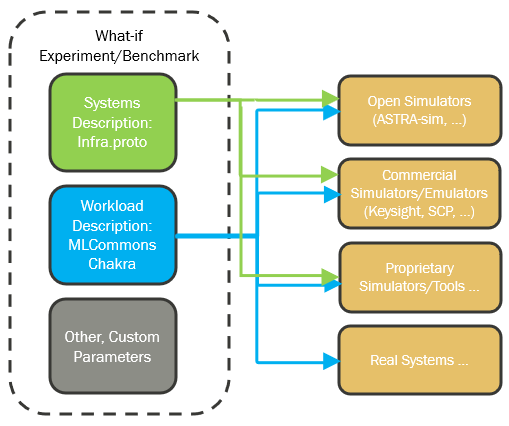

## The Challenge in System Description
Building and managing AI/HPC systems today feels a bit like untangling a giant ball of yarn.

Modern AI systems integrate `complex, heterogeneous components` like compute, memory, and storage, all connected by diverse scale-up and scale-out interconnect topologies. Think of the `intricate networks` in a large AI factory – it's a mix of different technologies and topologies."

But, a clear, `standardized` way to describe this overall infrastructure is missing. This isn't just a technical challenge; it creates real problems for everyone involved. It makes it incredibly difficult to benchmark, to simulate 'what-if' scenarios, or even to manage these systems efficiently. The result? `Significant operational overhead`, often `low hardware utilization`, and a `lot of frustration` for those trying to get these powerful systems to perform."

We believe `capturing this diversity, this inherent complexity, in a structured way` is the first step to reasoning with it."

## Why Standardize?
Why go through all this effort? Because we want to move beyond just 'making it work' to truly 'optimizing it.' Our goal is to transform massive AI clusters from monolithic problems into structured, analyzable systems. When you have a standardized description, you can feed that information directly into your tools – your simulators, your emulators, even your deployment systems.

This means better predictions about how your AI workloads will perform before you even run them. And it opens the door for something really powerful when doing 'vertical co-design.' It's about making sure your hardware and software are talking to each other, working together seamlessly, from the lowest-level chip to the highest-level application. This ensures accurate performance prediction and validates AI workloads pre-deployment.

This isn't just about efficiency; it's about building performant, reliable, and cost-effective AI infrastructure that can keep up with the demands of tomorrow and experimenting with what-if scenarios.  Let's look at a concrete example.

## From Schema to Simulation/Emulation

* infrastructure schema + MLCommons Chakra
    * standardized `infrastructure schema` defines system of systems
    * `chakra` provides workload traces
* topology input for various tools (ASTRA-Sim)
* enabled `what-if` analysis, design choices
* democratizes complex system evaluation
* `infrastructure schema` is a flexible starting point today

## Introducing GRAPHIT (Graph based Infrastructure)
A graph is a natural fit to describe a system of systems in a clear, intuitive, and mathematically precise manner.

* Node or vertex represents an entity like a component, device, user, router, etc
* Edge represents a relationship between nodes
* Properties store additional information about nodes or edges

### Principles
[GraphIt](https://github.com/Keysight/graphit) is a `collection of APIs and Models` used to describe AI/HPC infrastructure based on the following core principles:

* logical infrastructure can be described using graph concepts such as vertexes and edges
    * vertexes are device instances
    * an edge is 2 device instances separated by a link
    * a path is a collection of connections
* there is a difference between logical infrastructure and physical definition
* logical infrastructure should be composable
* logical infrastructure is loosely coupled to physical definitions
* due to the possible scale of AI/HPC deployments, logical infrastructure needs to be scalable without duplicating content
* the repo makes use of [OpenAPIArt](https://github.com/open-traffic-generator/openapiart)
    * to create declarative APIs and Models
    * auto-generate the following artifacts:
        * [Redocly documentation](openapi.html) of APIs and Models
        * client and/or server side `Fluent Python/Go SDKs` over `REST/Protobuf` transports
