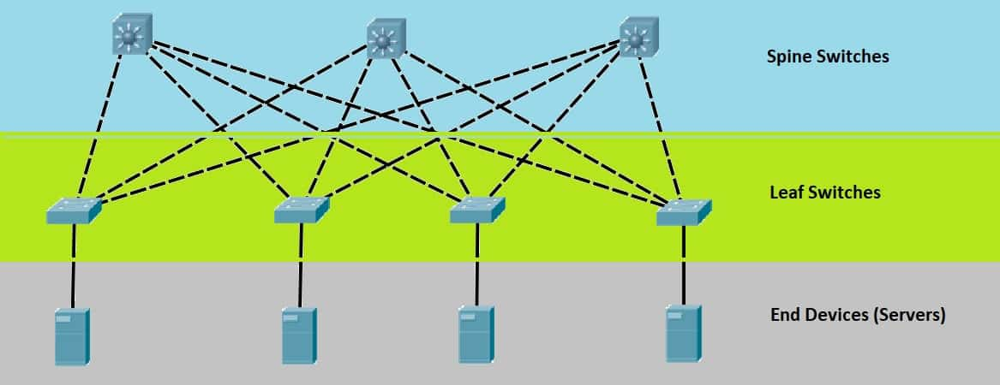

# Case Study: Two Tier Clos Fabric
The main steps in designing a network infrastructure are as follows:

* Use text and/or diagrams to create an `infrastructure description`
* Then `use the standardized schema to capture the infrastructure description` in a machine readable format by doing the following:
    * Add infrastructure `device` subgraphs using `components` and `links` to create `edges` between components
    * Add infrastructure `instances` to define the number of devices in a reusable manner
    * Add infrastructure `links` to define additional information that exists between device `instances` in the infrastructure
    * Add infrastructure `edges` between device `instances`

## Infrastructure Description
The following is a diagrammatic and textual description of a `generic two tier clos fabric` that will be modeled using the standardized schema.



It consists of the following devices:

* 4 generic `servers` with each server composed of 4 npus and 4 nics with each nic directly connected to one npu via a pcie link.  Also every npu in a server is connected to every other npu by an nvlink switch.
* 4 `leaf switches` composed of one asic and 16 ethernet ports
* 3 `spine switches` composed of one asic and 16 ethernet ports

The above devices will be interconnected in the following manner:

* each `leaf` switch is connected directly to 1 `server` and to all `spine` switches
* every `server` is connected to a `leaf` switch at 100 gpbs
* every `leaf` switch is connected to every `spine` switch at 400 gpbs

## Standardized Definitions
A standardized definition of the preceding two tier clos fabric can be created by following these steps:

* The device is a subgraph which is composed of two components connected to each other using a link.
* It acts as a blueprint allowing for a single definition to be reused multiple times for optimal space complexity.

#### Create a Server Device
Define a server device based on the infrastructure description.
<details open>
<summary><strong>Server device definition using OpenApiArt generated classes</strong></summary>
```python

```
</details>
<details closed>
<summary><strong>Server device definition as yaml</strong></summary>
```yaml

```
</details>

#### Create a Switch Device
Define a switch device based on the infrastructure description.
<details open>
<summary><strong>Switch device definition using OpenApiArt generated classes</strong></summary>
```python

```
</details>
<details closed>
<summary><strong>Switch device definition as yaml</strong></summary>
```yaml

```
</details>

#### Create an Infrastructure of Instances of devices, Links and Edges
Define an infrastructure based on the infrastructure description.
<details open>
<summary><strong>Two Tier Clos Fabric Infrastructure using OpenApiArt generated classes</strong></summary>
```python

```
</details>

<details closed>
<summary><strong>ClosFabric infrastructure definition as yaml</strong></summary>
```yaml

```
</details>

