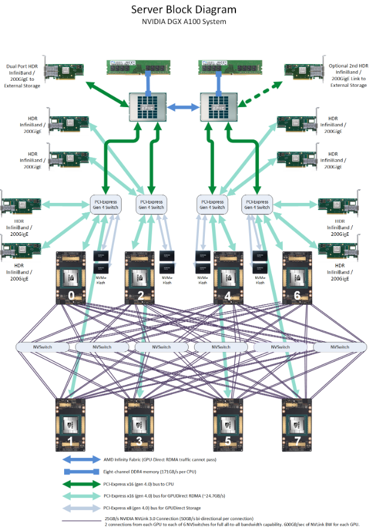
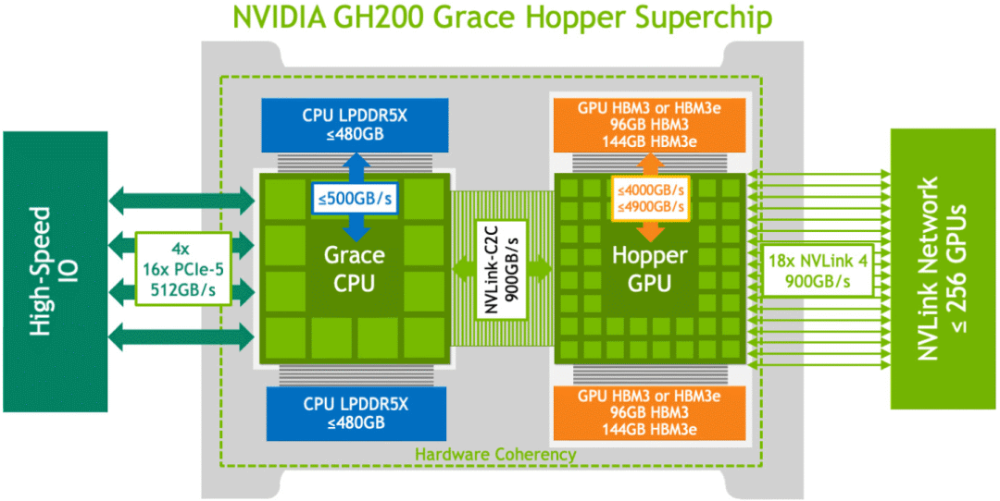
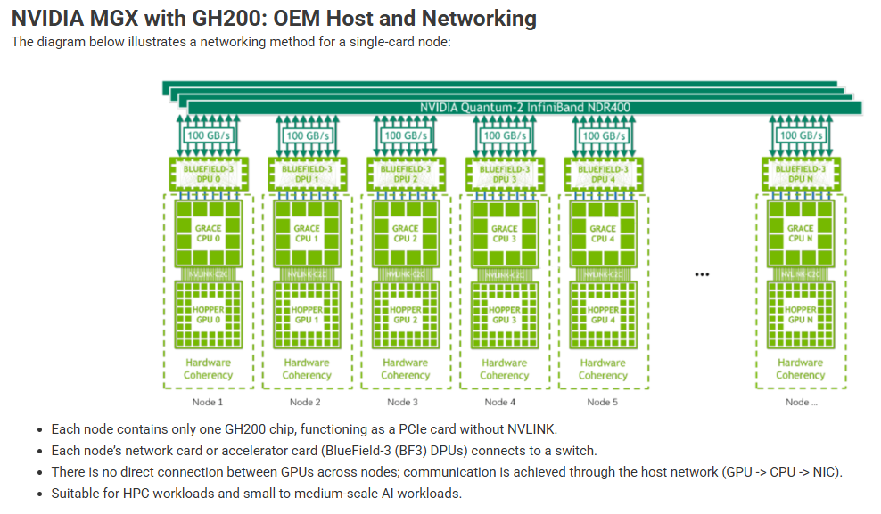
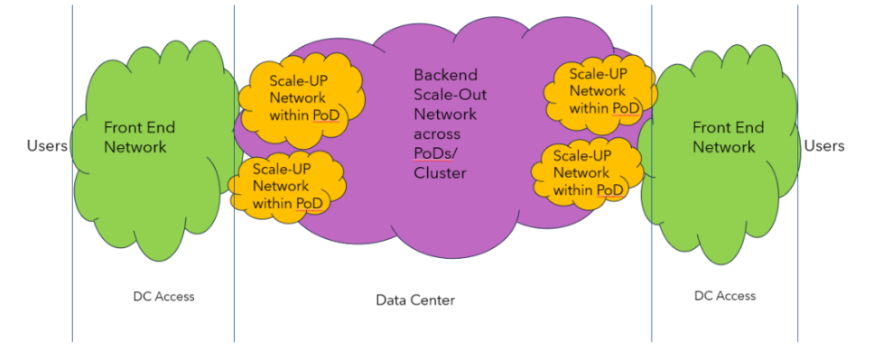
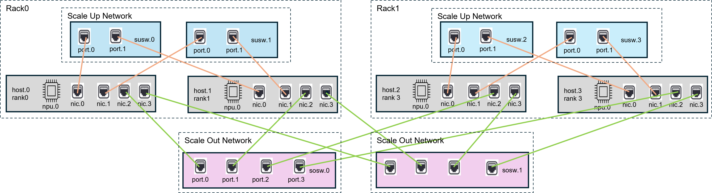

These examples demonstrate `describing` a variety of devices and infrastructures using text descriptions and diagrams to `defining` them using a `standardized schema`.

## DGX-A100 Server
This server diagram acts as an example of how multiple components can be connected to a single component such as multiple gpu components are connected to a single pcie switch.

The graph model is able to capture the asymmetric layout of the device.

### Description


### Standardized Definition
<details open>
<summary><strong>DGX device definition using OpenApiArt generated classes</strong></summary>
```python

```
</details>
<details closed>
<summary><strong>DGX device definition as yaml</strong></summary>
```yaml

```
</details>

## GH200-MGX
### Description
#### XPU Component

#### Device


### Standardized Definition
<details open>
<summary><strong>GH200-MGX device definition using OpenApiArt generated classes</strong></summary>
```python
TBD...
```
</details>

## ScaleUp/ScaleOut Infrastructure

### Description

https://mips.com/blog/reimagining-ai-infrastructure-the-power-of-converged-back-end-networks/


- 1024 hosts
    - 1 xpu/host
    - 10 nics/host
- 512 scaleup switches
    - 16 ports/switch
- 2 scaleout switches
    - 1024 ports/switch
- 64 Racks
    - 16 hosts/rack
    - 8 scale up switches/rack



### Standardized Definition
<details open>
<summary><strong>ScaleUp/ScaleOut infrastructure definition using OpenApiArt generated classes</strong></summary>
```python
TBD...
```
</details>
