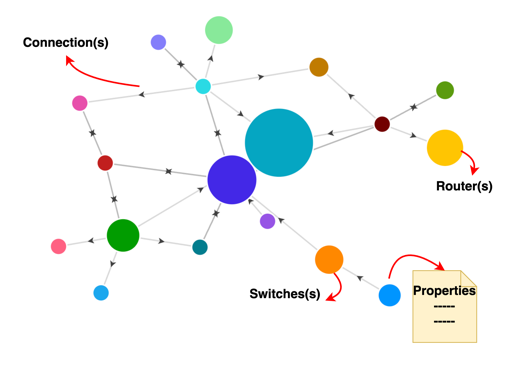

## Introducing the InfraGraph (INFRAstructure GRAPH) schema
A graph is a natural fit to describe a system of systems in a clear, intuitive, and mathematically precise manner.

* Node or vertex represents an entity like a component, device, user, router, etc
* Edge represents a relationship between nodes
* Properties store additional information about nodes or edges

### Principles
[InfraGraph](https://github.com/Keysight/infragraph) is a `collection of APIs and Models` used to describe AI/HPC infrastructure based on the following core principles:

* infrastructure can be described using graph concepts such as vertexes, edges and properties
    * vertexes can be `component` or device `instances`
    * an edge contained by a device subgraph is 2 component instances separated by a link
        * e.g., `xpu.0`.`pcie`.`nic.0`
    * an edge contained by the infrastructure is 2 device connections separated by a link where a device connection is the device `instance` name and `index` and external `component` name and `index`
        * e.g., `server.0`.`nic.0`.`eth`.`leafsw.0`.`port.0`
    * a path is a collection of infrastructure and device connections between a single source and destination
    * properties are fields with in the device and component objects
* devices are composable using connections
* connections dictate the depth of the graph
* infrastructure and device connections dictate the shape of the graph
* infrastructure needs to be scalable without duplicating content

## OpenapiArt
This repository makes use of [OpenAPIArt](https://github.com/open-traffic-generator/openapiart) to do the following:

* create declarative intent based Models and APIs
* auto-generate the following artifacts:
    * openapi schema
    * protobuf schema
    * [Redocly documentation](https://infragraph.dev/openapi.html) of APIs and Models
    * `Python/Go SDKs` that allow for creating `fluent` client/server code over `REST/Protobuf` transports
