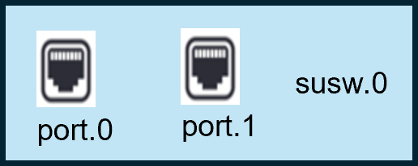
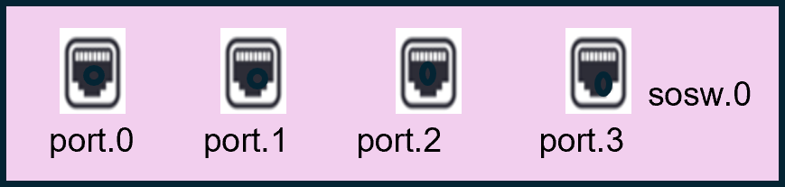
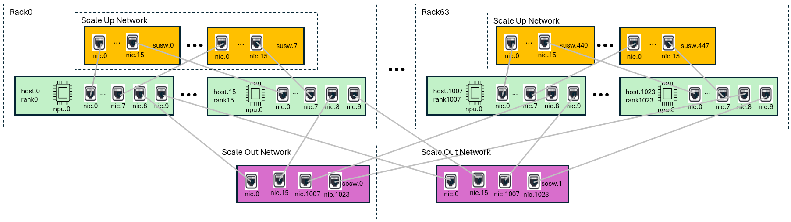

## [Features](model.md)

Cluster Infrastructure as a graph is an actively developed specification, with contributions from real [use cases](examples.md). The model defines the following components to define a infrastructure:
<!-- TODO add links from bold items to paragraphs in Model section -->
* **Device** definitions with ability to model its internals as a graph
* **Device Components** allowing users to define the device internal components like:
    - nic
    - ports
    - npus
* **Links** definition for:
    - components interconnect
	- device interconnect
    - Defining the bandwidth of the links
* **Connections** between:
    - internal components of a device
    - one device to another

Explore an in-depth explanation of the topology model, covering its structure, essential components, and how it supports efficient design and analysis. [This resource](model.md) provides valuable insights into the principles behind topology and how to apply them effectively.

## [Annotation](annotate.md)

This section provides a comprehensive guide on how a user can annotate various parts of infrastructre and add more details like DeviceType, Rank Identifier and so on. It covers the model description with examples for binding physical attributes with the logical infrastructure definition.


## [Getting Started With Topology Creation](create.md)

[This walkthrough](create.md) guide demonstrates how anyone can create a topology from scratch, highlighting key steps and best practices to build a solid foundation. It offers a clear, step-by-step approach that makes topology creation accessible to beginners and experts alike.

## Community

Use our community resources to get help with Infrastructure As A Graph:

* [Infrastructure As A Graph on Github](https://github.com/Keysight/graphit)


#### Infrastructure Connections

- Create Connection between Components using Links
- Defining External Links: Here we define the external link type that connects two devices

- Building the infrastructure as graph
  - Instantiating devices: Use the device definition in the inventory as a template to create multiple devices for the infrastructure.
  - Defining connections: Use the external link definition to create connections between device instances.

Follow these steps to design a Scale Up and Out Infrastructure.

### Creating Device Inventory

Device inventory outlines the necessary devices for infrastructure, including components and links. It acts as a blueprint to create and connect instances, aiming to define once and reuse multiple times for optimal space complexity. For example, in a network with 100 switches (50 each of 2 types) connected by 100G ethernet links, the inventory will only specify the 2 switch types and the 100G ethernet link type.

> Note that the entire device does not need to be described in full detail. The level of device detail should be dictated by the needs of the application.

To define a Device:

- use the `Component` message to define individual components (vertexes) that are present in a device
- use the `Component - count` field to scale up the number of components in the device
- use the `Link` message to define different link types within the device
- use the `Device` message to contain `Component` and `Link` messages
- use the `Device - connections` field to connect components (vertexes) to each other with an associated link to form an edge
  - the format of a `connections` string is described in the infra.proto file

Now we will be designing a 4 port generic switch as a part of device inventory.

### Defining 2 port scale up switch

Lets define a simple 2 port scale up switch.


This switch is made of two front panel ports.

User can define this switch with one major "port" components inside it. These components can be viewed as nodes in a graph.

<details open>
<summary><strong>YAML Definition</strong></summary>

```yaml
inventory:
  devices:
    SCALE_UP_SWITCH:
      name: SCALE_UP_SWITCH
      components:
        port:
          count: 2
          name: port
          nic:
            ethernet: {}
      connections: []
      links: {}
```

</details>

<br>

<details>
<summary><strong>JSON Definition</strong></summary>

```json
{
  "inventory": {
    "devices": {
      "SCALE_UP_SWITCH": {
        "name": "SCALE_UP_SWITCH",
        "components": {
            "port": {
                "name": "port",
                "count": 2,
                "nic": {
                    "ethernet": { }
                }
            }
        },
        "links": {
        },
        "connections": [
        ]
    }
  }
}
```

</details>

<br>

We have specified a scale up switch with 2 port components. Now we can define a scale out switch with 4 port components.

### Defining 4 port scale out switch

Lets define a simple 2 port scale up switch.


This switch is made of four front panel ports.

User can define this switch with one major "port" components inside it. These components are analogous to a node in a graph.

<details open>
<summary><strong>YAML Definition</strong></summary>

```yaml
inventory:
  devices:
    SCALE_OUT_SWITCH:
      name: SCALE_OUT_SWITCH
      components:
        port:
          count: 4
          name: port
          nic:
            ethernet: {}
      connections: []
      links: {}
```

</details>

<br>

<details>
<summary><strong>JSON Definition</strong></summary>

```json
{
    "inventory": {
        "devices": {
            "SCALE_OUT_SWITCH": {
                "name": "SCALE_OUT_SWITCH",
                "components": {
                    "port": {
                        "name": "port",
                        "count": 4,
                        "nic": {
                            "ethernet": { }
                        }
                    }
                },
                "links": {
                },
                "connections": [
                ]
            },
        }
    }
}
```

</details>

<br>


### Design host with 4 nics and single xpu

Let's design a host with 4 nics and a single xpu


Our Host has two interconnected components:
- 4 nics
- 1 xpu

These components are connected to each other via a pcie connection. Therefore to connect two different components, we can use the following notation:

`<source>.<link>.<destination>`

The `<source>` contains the source component and its index. The `<destination>` specifies the destination component and its index. The link joins the source and the destination. Therefore, the connection would look something like this:

```
<source>.<src_index>.<link>.<destination>.<dst_index>
```

These components can be defined as node in a graph which are connected through an edge (pcie) link in this case. We need to define the links as well as connections with which the whole device definition is defined below:

<details open>
<summary><strong>YAML Definition</strong></summary>

```yaml
inventory:
  devices:
    HOST:
      name: HOST
      components:
        nic:
          name: nic
          count: 4
          nic:
            ethernet: {}
        xpu:
          name: xpu
          count: 1
          xpu: {}
      links:
        pcie:
          name: pcie
      connections:
      - xpu.0.pcie.nic.0
      - xpu.0.pcie.nic.1
      - xpu.0.pcie.nic.2
      - xpu.0.pcie.nic.3
```

</details>

<br>

<details>
<summary><strong>JSON Definition</strong></summary>

```json
{
    "inventory": {
        "devices": {
            "HOST": {
                "name": "HOST",
                "components": {
                    "xpu": {
                        "name": "xpu",
                        "count": 1,
                        "xpu": { }
                    },
                    "nic": {
                        "name": "nic",
                        "count": 4,
                        "nic": {
                            "ethernet": { }
                        }
                    }
                },
                "links": {
                    "pcie": {
                        "name": "pcie"
                    }
                },
                "connections": [
                    "xpu.0.pcie.nic.0",
                    "xpu.0.pcie.nic.1",
                    "xpu.0.pcie.nic.2",
                    "xpu.0.pcie.nic.3"
                ]
            }
        }
    }
}
```

</details>

<br>


### Defining Links

The objective is to define an infrastructure build using the switch and hosts defined earlier. The goal is to build an infrastructure where one switch is directly connected to four hosts via 100G Ethernet.



We have defined a switch and a host in the inventory, but not the 100G links. Let's define a 100G ethernet link as follows:

<details open>
<summary><strong>YAML Definition</strong></summary>

```yaml
inventory:
  links:
  eth:
    name: eth
    description: Ethernet link
    bandwidth:
      gbps: 100
```

</details>

<br>

<details>
<summary><strong>JSON Definition</strong></summary>

```json
{
  "inventory": {
    "links": {
      "eth": {
        "name": "eth",
        "description": "Ethernet link",
        "bandwidth": {
          "gbps": 100
        }
      }
    }
  }
}
```

</details>

<br>

In this example, we have defined a link `name: eth` with a bandwidth of 100 gbps. Subsequently, four such links will be utilized to connect four devices to four switch ports, as illustrated in the above image.

### Creating Device Instances

We can scale the infrastructure by using the `device instance` message. To create a fully connected topology, we instantiate the defined devices by giving a new `instance_name` to the device followed by a count. Therefore to create instances for host, scale up and scale out switch, we define the instance as following:

<details open>
<summary><strong>YAML Definition</strong></summary>

```yaml
deviceInstances:
  host:
    count: 4
    device: HOST
    name: host
  sosw:
    count: 2
    device: SCALE_OUT_SWITCH
    name: sosw
  susw:
    count: 4
    device: SCALE_UP_SWITCH
    name: susw
```

</details>

<br>

<details>
<summary><strong>JSON Definition</strong></summary>

```json
{
    "deviceInstances": {
        "host": {
            "name": "host",
            "device": "HOST",
            "count": 4
        },
        "susw": {
            "name": "susw",
            "device": "SCALE_UP_SWITCH",
            "count": 4
        },
        "sosw": {
            "name": "sosw",
            "device": "SCALE_OUT_SWITCH",
            "count": 2
        }
    }
}
```

</details>

<br>

The devices are defined under the `inventory - devices` section, serving as a blueprint or template. These devices need to be instantiated to create the entire infrastructure, similar to creating objects of a class. With the specified count, multiple copies of the devices are created starting from index 0.

Next, these device instances need to be connected over 100G ethernet links as illustrated in the picture above.

### Connecting Device Instances

Connections between the devices are made by the components of the device and links defined. Therefore, to connect two devices together, we need to define the connection in the following format:

```
<src_device>.<dev_index><src_component><comp_index>.<link>.<dst_device>.<dev_index><dst_component><comp_index>
```

The `<src_device>.<dev_index><src_component><comp_index>` specifies the source device, its index, component, and the component's index. The same format applies to the destination. The link defines the connection between source and destination.

A "." separator separates infrastructure elements. To connect a `host` with the `scale_up_switch`, we define the connection as:

<details open>
<summary><strong>YAML Definition</strong></summary>

```yaml
connections:
  - host.0.nic.0.eth.susw.0.port.0
```

</details>

<br>

<details>
<summary><strong>JSON Definition</strong></summary>

```json
{
  "connections": ["host.0.nic.0.eth.susw.0.port.0"]
}
```

</details>

<br>

The host at index 0, via its nic component 0, is connected to port 0 of scale up switch or `susw` 0. The link between this source and destination has a bandwidth of eth. This describes the first link shown in the above picture.

Creating the links:

<details open>
<summary><strong>YAML Definition</strong></summary>

```yaml
connections:
    - host.0.nic.0.eth.susw.0.port.0
    - host.0.nic.1.eth.susw.1.port.0
    - host.0.nic.2.eth.sosw.0.port.0
    - host.0.nic.3.eth.sosw.1.port.0
    - host.1.nic.0.eth.susw.0.port.1
    - host.1.nic.1.eth.susw.1.port.1
    - host.1.nic.2.eth.sosw.0.port.1
    - host.1.nic.3.eth.sosw.1.port.1
    - host.2.nic.0.eth.susw.2.port.0
    - host.2.nic.1.eth.susw.3.port.0
    - host.2.nic.2.eth.sosw.0.port.2
    - host.2.nic.3.eth.sosw.1.port.2
    - host.3.nic.0.eth.susw.2.port.1
    - host.3.nic.1.eth.susw.3.port.1
    - host.3.nic.2.eth.sosw.0.port.3
    - host.3.nic.3.eth.sosw.1.port.3
```

</details>

<br>

<details>
<summary><strong>JSON Definition</strong></summary>

```json
{
  "connections": [
        "host.0.nic.0.eth.susw.0.port.0",
        "host.0.nic.1.eth.susw.1.port.0",
        "host.0.nic.2.eth.sosw.0.port.0",
        "host.0.nic.3.eth.sosw.1.port.0",
        "host.1.nic.0.eth.susw.0.port.1",
        "host.1.nic.1.eth.susw.1.port.1",
        "host.1.nic.2.eth.sosw.0.port.1",
        "host.1.nic.3.eth.sosw.1.port.1",
        "host.2.nic.0.eth.susw.2.port.0",
        "host.2.nic.1.eth.susw.3.port.0",
        "host.2.nic.2.eth.sosw.0.port.2",
        "host.2.nic.3.eth.sosw.1.port.2",
        "host.3.nic.0.eth.susw.2.port.1",
        "host.3.nic.1.eth.susw.3.port.1",
        "host.3.nic.2.eth.sosw.0.port.3",
        "host.3.nic.3.eth.sosw.1.port.3"
    ]
}
```

</details>

<br>

## The Complete Example

After combining all the definitions, we can arrive at the final design:

<details open>
<summary><strong>YAML Definition</strong></summary>

```yaml

inventory:
  devices:
    HOST:
      name: HOST
      components:
        nic:
          name: nic
          count: 4
          nic:
            ethernet: {}
        xpu:
          name: xpu
          count: 1
          xpu: {}
      links:
        pcie:
          name: pcie
      connections:
      - xpu.0.pcie.nic.0
      - xpu.0.pcie.nic.1
      - xpu.0.pcie.nic.2
      - xpu.0.pcie.nic.3
    SCALE_OUT_SWITCH:
      name: SCALE_OUT_SWITCH
      components:
        port:
          name: port
          count: 4
          nic:
            ethernet: {}
      links: {}
      connections: []
    SCALE_UP_SWITCH:
      name: SCALE_UP_SWITCH
      components:
        port:
          name: port
          count: 2
          nic:
            ethernet: {}
      links: {}
      connections: []
  links:
    eth:
      name: eth
      bandwidth:
        gbps: 100
      description: Ethernet link
deviceInstances:
  host:
    name: host
    device: HOST
    count: 4
  sosw:
    name: sosw
    device: SCALE_OUT_SWITCH
    count: 2
  susw:
    name: susw
    device: SCALE_UP_SWITCH
    count: 4
connections:
- host.0.nic.0.eth.susw.0.port.0
- host.0.nic.1.eth.susw.1.port.0
- host.0.nic.2.eth.sosw.0.port.0
- host.0.nic.3.eth.sosw.1.port.0
- host.1.nic.0.eth.susw.0.port.1
- host.1.nic.1.eth.susw.1.port.1
- host.1.nic.2.eth.sosw.0.port.1
- host.1.nic.3.eth.sosw.1.port.1
- host.2.nic.0.eth.susw.2.port.0
- host.2.nic.1.eth.susw.3.port.0
- host.2.nic.2.eth.sosw.0.port.2
- host.2.nic.3.eth.sosw.1.port.2
- host.3.nic.0.eth.susw.2.port.1
- host.3.nic.1.eth.susw.3.port.1
- host.3.nic.2.eth.sosw.0.port.3
- host.3.nic.3.eth.sosw.1.port.3
```

</details>

<br>

<details>
<summary><strong>JSON Definition</strong></summary>

```json
{
    "inventory": {
        "devices": {
            "SCALE_OUT_SWITCH": {
                "name": "SCALE_OUT_SWITCH",
                "components": {
                    "port": {
                        "name": "port",
                        "count": 4,
                        "nic": {
                            "ethernet": { }
                        }
                    }
                },
                "links": {
                },
                "connections": [
                ]
            },
            "SCALE_UP_SWITCH": {
                "name": "SCALE_UP_SWITCH",
                "components": {
                    "port": {
                        "name": "port",
                        "count": 2,
                        "nic": {
                            "ethernet": { }
                        }
                    }
                },
                "links": {
                },
                "connections": [
                ]
            },
            "HOST": {
                "name": "HOST",
                "components": {
                    "xpu": {
                        "name": "xpu",
                        "count": 1,
                        "xpu": { }
                    },
                    "nic": {
                        "name": "nic",
                        "count": 4,
                        "nic": {
                            "ethernet": { }
                        }
                    }
                },
                "links": {
                    "pcie": {
                        "name": "pcie"
                    }
                },
                "connections": [
                    "xpu.0.pcie.nic.0",
                    "xpu.1.pcie.nic.1",
                    "xpu.2.pcie.nic.2",
                    "xpu.3.pcie.nic.3"
                ]
            }
        },
        "links": {
            "eth": {
                "name": "eth",
                "description": "Ethernet link",
                "bandwidth": {
                    "gbps": 100
                }
            }
        }
    },
    "deviceInstances": {
        "host": {
            "name": "host",
            "device": "HOST",
            "count": 4
        },
        "susw": {
            "name": "susw",
            "device": "SCALE_UP_SWITCH",
            "count": 4
        },
        "sosw": {
            "name": "sosw",
            "device": "SCALE_OUT_SWITCH",
            "count": 2
        }
    },
    "connections": [
        "host.0.nic.0.eth.susw.0.port.0",
        "host.0.nic.1.eth.susw.1.port.0",
        "host.0.nic.2.eth.sosw.0.port.0",
        "host.0.nic.3.eth.sosw.1.port.0",
        "host.1.nic.0.eth.susw.0.port.1",
        "host.1.nic.1.eth.susw.1.port.1",
        "host.1.nic.2.eth.sosw.0.port.1",
        "host.1.nic.3.eth.sosw.1.port.1",
        "host.2.nic.0.eth.susw.2.port.0",
        "host.2.nic.1.eth.susw.3.port.0",
        "host.2.nic.2.eth.sosw.0.port.2",
        "host.2.nic.3.eth.sosw.1.port.2",
        "host.3.nic.0.eth.susw.2.port.1",
        "host.3.nic.1.eth.susw.3.port.1",
        "host.3.nic.2.eth.sosw.0.port.3",
        "host.3.nic.3.eth.sosw.1.port.3"
    ]
}
```

</details>

<br>
